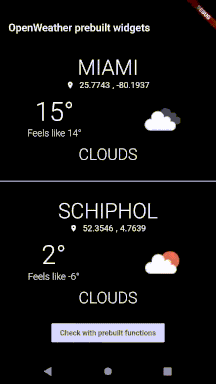

# open_weather_client

Unofficial Dart package in order to make use of [OpenWeatherMAP API](https://openweathermap.org/) easily.
The plugin can currently be used to fetch weather data by city name or geolocation(latitude, longitude) and by ZIP Code (zipCode and countryCode).
The plugin also supports 5 days weather forecast by city name, geolocation and by ZIP code

The plugin also supports multiple unit types:  
To receive all data in Fahrenheit, use `WeatherUnits.STANDARD`\
For Celsius, use `WeatherUnits.METRIC`\
For Kelvin use `WeatherUnits.IMPERIAL`

## Demo



## Install package

To install the dependency, add `open_weather_client` to your `pubspec.yaml`.

## Usage

### Prebuilt functions for current weather

Before you can use the plugin, you need an API key from [OpenWeatherMAP](https://openweathermap.org/). The plugin only uses those endpoints that can be acquired for free.

Once you have the API key, do the following:

```dart
import 'package:open_weather_client/open_weather.dart';

...

OpenWeather openWeather =  OpenWeather(apiKey: 'YOUR_API_KEY');
```

The current weather is fetched through the city name or geolocation.

```dart
  final String _key = 'YOUR_API_KEY';
  final String _cityName = 'Florida';
  final double _latitude = 52.3545828;
  final double _longitude = 4.7638781;
  final int _zipCode = 3512;
  final String _countryCode = 'NL';
```

For fetching through city name, you can do the following:

```dart
  WeatherData weatherData = await openWeather
        .currentWeatherByCityName(
            cityName: _cityName, weatherUnits: WeatherUnits.METRIC)
        .catchError((err) => print(err));
```

For fetching through geolocation, you can do the following:

```dart
  WeatherData weatherData = await openWeather
        .currentWeatherByLocation(
            latitude: _latitude,
            longitude: _longitude,
            weatherUnits: WeatherUnits.METRIC)
        .catchError((err) => print(err));
```

For fetching through ZIP Code, you can do the following:

```dart
  WeatherData weatherData = await openWeather
        .currentWeatherByZipCode(
            zipCode: _zipCode,
            countryCode: _countryCode,
            weatherUnits: WeatherUnits.METRIC)
        .catchError((err) => print(err));
```
#### Accessing values

In order to access the fetched weather values, you can go through each classes holding the specific values.\

The `Coordinates` class holds the following info:

- lat (City geo location, latitude, retrieved from the API)
- lon (City geo location, longitude, retrieved from the API)

The `Details` class holds the following info:\
`Important! Details class retrieves a List, so you have to loop through it to access it's values.`

- id (Weather condition id coming from the API)
- weatherShortDescription (Group of weather parameters (Rain, Snow, Extreme etc.) coming from the API)
- weatherLongDescription (Weather condition within the group coming from the API)
- icon (holds the icon id used by [OpenWeatherMAP API](https://openweathermap.org/weather-conditions))

The `Temperature` class holds the following info:

- currentTemperature (Temperature. Unit Default: Kelvin, Metric: Celsius, Imperial: Fahrenheit. coming from the API)
- feelsLike (Temperature. This temperature parameter accounts for the human perception of weather. Unit Default: Kelvin, Metric: Celsius, Imperial: Fahrenheit. coming from the API)
- tempMin (Minimum temperature at the moment. This is minimal currently observed temperature (within large megalopolises and urban areas). Unit Default: Kelvin, Metric: Celsius, Imperial: Fahrenheit. coming from the API)
- tempMax (Maximum temperature at the moment. This is maximal currently observed temperature (within large megalopolises and urban areas). Unit Default: Kelvin, Metric: Celsius, Imperial: Fahrenheit. coming from the API)
- pressure (Atmospheric pressure (on the sea level, if there is no sea_level or grnd_level data), hPa, coming from the API)
- humidity (Humidity, %, coming from the API)

The `Wind` class holds the following info:

- speed (Wind speed. Unit Default: meter/sec, Metric: meter/sec, Imperial: miles/hour. coming from the API)
- deg (Wind direction, degrees (meteorological). coming from the API)
- gust (Wind gust. Unit Default: meter/sec, Metric: meter/sec, Imperial: miles/hour. coming from the API)

To access them you can do the following:

```dart
WeatherData weatherData = await openWeather
        .currentWeatherByCityName(
            cityName: _cityName, weatherUnits: WeatherUnits.METRIC)
        .catchError((err) => print(err))
        .then((data) {
      print(data.details.first.weatherShortDescription);
      print(data.name.toString());
      print(data.temperature.currentTemperature);
      print(data.wind.speed);
    });
```

### Prebuilt widgets for current weather

Alternativel you can use the built in widgets to populate your app with some nice UI showing weather insights:

For fetching through city name, you can do the following:

```dart
 OpenWeatherByCity(
                apiKey: _key,
                cityName: _cityName,
                weatherUnits: WeatherUnits.METRIC,
                color: Colors.white,
              )
```

For fetching through geolocation, you can do the following:

```dart
OpenWeatherByLocation(
                apiKey: _key,
                latitude: _latitude,
                longitude: _longitude,
                weatherUnits: WeatherUnits.METRIC,
                color: Colors.white,
              )

```

For fetching through ZIP Code, you can do the following:

```dart
OpenWeatherByZipCode(
                apiKey: _key,
                zipCode: _zipCode,
                countryCode: _countryCode,
                weatherUnits: WeatherUnits.METRIC,
                color: Colors.white,
              )

```

### Prebuilt functions for 5 days weather forecast
`Important! Forecast retrieves a List, so you have to loop through it to access it's values.`

For fetching through city name, you can do the following:

```dart
  WeatherForecastData weatherData = await openWeather
        .fiveDaysWeatherForecastByCityName(
            cityName: _cityName, weatherUnits: WeatherUnits.METRIC)
        .catchError((err) => print(err));
```

For fetching through geolocation, you can do the following:

```dart
  WeatherForecastData weatherData = await openWeather
        .fiveDaysWeatherForecastByLocation(
            latitude: _latitude,
            longitude: _longitude,
            weatherUnits: WeatherUnits.METRIC)
        .catchError((err) => print(err));
```

For fetching through ZIP Code, you can do the following:

```dart
  WeatherForecastData weatherData = await openWeather
        .fiveDaysWeatherForecastByZipCode(
            zipCode: _zipCode,
            countryCode: _countryCode,
            weatherUnits: WeatherUnits.METRIC)
        .catchError((err) => print(err));
```

For more info and demo implementation check the `example` folder.
